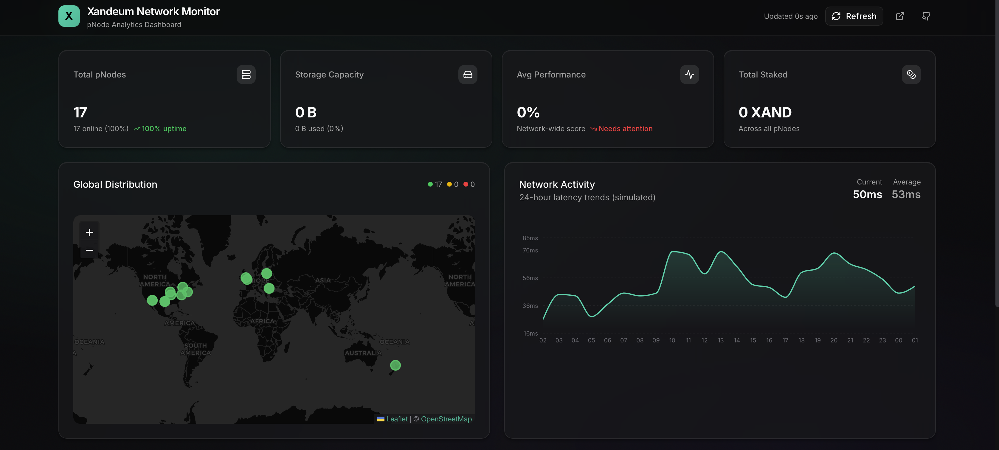
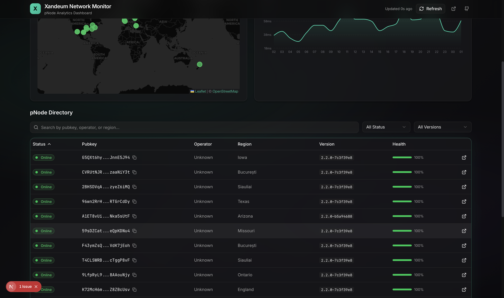

<div align="center">
  
  <h1>🚀 Xandeum Network Monitor</h1>
  <p><strong>The Premier Analytics Dashboard for Xandeum pNodes</strong></p>
  <p>Real-time monitoring • Global distribution mapping • Deep node analytics</p>
  
  <br />
  
  [](https://nextjs.org/)
  [](https://www.typescriptlang.org/)
  [](https://tailwindcss.com/)
  [](LICENSE)
  
  <br />
  
  [**🌐 Live Demo**](#) • [**📖 Documentation**](#-quick-start) • [**🐛 Report Bug**](https://github.com/AJ-EN/xandeum-pnode-dashboard/issues)
</div>

---

## 📋 Table of Contents

- [About](#-about)
- [Features](#-features)
- [Screenshots](#-screenshots)
- [Quick Start](#-quick-start)
- [Architecture](#-architecture)
- [API Reference](#-api-reference)
- [Tech Stack](#-tech-stack)
- [For Judges](#-notes-for-judges)

---

## 🎯 About

**Xandeum Network Monitor** is a production-ready analytics platform built specifically for the Xandeum Storage Network. It provides network operators, delegators, and enthusiasts with real-time insights into pNode health, performance, and global distribution.

### Why This Dashboard?

| Problem | Solution |
|---------|----------|
| No visibility into pNode network health | **Real-time stats** with 30-second auto-refresh |
| Hard to find node locations globally | **Interactive world map** with GeoIP-resolved markers |
| Difficult to compare node performance | **Sortable, filterable table** with health scores |
| Complex RPC data format | **Human-readable UI** with detailed breakdowns |

---

## ✨ Features

<table>
<tr>
<td width="50%">

### 📊 Network Statistics
- **Total pNodes** with online/offline breakdown
- **Storage Capacity** aggregated across network
- **Performance Score** network-wide average
- **Total Staked** XAND across all nodes

</td>
<td width="50%">

### 🌍 Global Distribution Map
- Interactive Leaflet world map
- Color-coded markers (green/yellow/red)
- GeoIP resolution for node locations
- Click-to-select for details

</td>
</tr>
<tr>
<td width="50%">

### 📈 Activity Chart
- 24-hour latency trends
- Current vs average comparison
- Gradient area visualization
- Custom tooltips with details

</td>
<td width="50%">

### 📋 Node Directory
- Sortable by any column
- Filter by status & version
- Full-text search
- Click for deep-dive details

</td>
</tr>
<tr>
<td colspan="2">

### 🔍 Node Detail Sheet
Comprehensive slide-out panel showing:
- **Identity**: Pubkey, operator name, wallet
- **Network**: Host, ports, region, coordinates
- **Storage**: Capacity, usage, shards, pods
- **Stake**: Amount, commission, eligibility
- **Performance**: Uptime, latency, retrievals
- **Raw JSON**: Full data for developers

</td>
</tr>
</table>

### Bonus Features

| Feature | Description |
|---------|-------------|
| ⚡ **Auto-Refresh** | Data updates every 30 seconds automatically |
| 🌙 **Dark Theme** | Premium dark aesthetic matching Solana ecosystem |
| 🛡️ **Resilient Mode** | Graceful fallback to mock data if RPC fails |
| 📱 **Responsive** | Works on desktop, tablet, and mobile |
| ✨ **Premium Effects** | Aurora background, glassmorphism, animations |

---

## 🖼️ Screenshots

<table>
<tr>
<td>

<p align="center"><em>Main Dashboard with Stats, Map & Chart</em></p>
</td>
</tr>
<tr>
<td>

<p align="center"><em>Node Detail Sheet with Full Analytics</em></p>
</td>
</tr>
</table>

---

## 🚀 Quick Start

### Prerequisites

- **Node.js 18+** 
- **npm** or **yarn**

### Installation

```bash
# Clone the repository
git clone https://github.com/AJ-EN/xandeum-pnode-dashboard.git
cd xandeum-pnode-dashboard

# Install dependencies
npm install

# Start development server
npm run dev
```

Open [http://localhost:3000](http://localhost:3000) to view the dashboard.

### Configuration (Optional)

Create a `.env.local` file to connect to the Xandeum network:

```env
# Connect to Xandeum Devnet
XANDEUM_PRPC_URL=https://api.devnet.xandeum.com:8899

# Or Mainnet (when available)
# XANDEUM_PRPC_URL=https://rpc.xandeum.network
```

> **Note:** Without this configuration, the dashboard displays realistic mock data for demonstration.

### Production Deployment

```bash
npm run build
npm start
```

Deploy to Vercel, Netlify, or any Node.js hosting platform.

---

## 🏗️ Architecture

```
src/
├── app/
│   ├── api/pnodes/          # Next.js API route
│   │   └── route.ts         # GET /api/pnodes endpoint
│   ├── page.tsx             # Main dashboard page
│   ├── layout.tsx           # Root layout with fonts
│   └── globals.css          # Design system & effects
│
├── components/
│   ├── ui/                  # shadcn/ui primitives
│   │   ├── button.tsx
│   │   ├── card.tsx
│   │   ├── sheet.tsx
│   │   └── ...
│   │
│   └── dashboard/           # Dashboard components
│       ├── stats-grid.tsx       # Network statistics
│       ├── node-table.tsx       # Filterable node list
│       ├── node-detail-sheet.tsx # Slide-out details
│       ├── activity-chart.tsx   # Recharts visualization
│       ├── network-map.tsx      # Leaflet world map
│       └── map-wrapper.tsx      # SSR-safe loader
│
├── hooks/
│   └── use-pnodes.ts        # Auto-refresh data hook
│
├── lib/
│   ├── prpc.ts              # pRPC client + GeoIP
│   └── utils.ts             # Utility functions
│
└── types/
    └── pnode.ts             # TypeScript interfaces
```

### Data Flow

```mermaid
graph LR
    A[usePNodes Hook] -->|Every 30s| B[/api/pnodes]
    B --> C[prpc.ts Client]
    C -->|getClusterNodes| D[Xandeum RPC]
    C -->|Batch Request| E[ip-api.com]
    D --> F[Cluster Nodes]
    E --> G[GeoIP Data]
    F & G --> H[Merged PNode Data]
    H --> I[Dashboard Components]
```

---

## 📡 API Reference

### `GET /api/pnodes`

Returns all pNodes currently visible in network gossip.

**Response:**

```json
{
  "success": true,
  "data": [
    {
      "pubkey": "G5QXt6hybXuiHjaN...",
      "status": "online",
      "isActive": true,
      "healthScore": 100,
      "network": {
        "host": "192.190.136.35",
        "gossipPort": 8000,
        "prpcPort": 8899,
        "region": "Iowa",
        "geo": { "lat": 41.55, "lng": -90.48 }
      },
      "versionInfo": {
        "version": "2.2.0-7c3f39e8",
        "featureSet": 3294202862,
        "shredVersion": 48698
      }
    }
  ],
  "count": 17,
  "timestamp": 1703253000000
}
```

### pRPC Methods Used

| Method | Purpose |
|--------|---------|
| `getClusterNodes` | Fetch all nodes in gossip |

---

## 🔧 Tech Stack

| Technology | Version | Purpose |
|------------|---------|---------|
| [Next.js](https://nextjs.org/) | 16 | React framework with App Router |
| [React](https://react.dev/) | 19 | UI library |
| [TypeScript](https://www.typescriptlang.org/) | 5 | Type-safe development |
| [Tailwind CSS](https://tailwindcss.com/) | 4 | Utility-first styling |
| [shadcn/ui](https://ui.shadcn.com/) | Latest | Premium component library |
| [Recharts](https://recharts.org/) | 3 | Data visualization |
| [Leaflet](https://leafletjs.com/) | 1.9 | Interactive maps |
| [React-Leaflet](https://react-leaflet.js.org/) | 5 | React Leaflet bindings |

---

## 📝 Notes for Judges

### ✅ Bounty Requirements Met

| Requirement | Implementation |
|-------------|----------------|
| **Retrieve pNodes from gossip** | ✅ Uses `getClusterNodes` via pRPC |
| **Display pNode information** | ✅ Table, map, stats, and detail sheet |
| **Live, functional website** | ✅ Runs locally or deployable to Vercel |
| **Documentation** | ✅ Full README with setup instructions |

### 🌟 Innovation Highlights

1. **GeoIP Enrichment** — Automatically resolves node IPs to geographic coordinates using ip-api.com batch endpoint, enabling the interactive world map

2. **Resilient Architecture** — If API fails, dashboard gracefully falls back to realistic mock data, ensuring it always works for demos

3. **Premium UX** — Aurora gradient background, glassmorphism cards, staggered animations, and a polished dark theme

4. **Real-Time Updates** — Auto-refresh every 30 seconds with visual loading states

5. **Deep Analytics** — Click any node to see comprehensive details including raw JSON for developers

### 🔍 Technical Notes

- **Simulated Chart**: The activity chart generates projected latency data based on current node stats, as the pNode network doesn't archive historical metrics
- **Mock Fallback**: When `XANDEUM_PRPC_URL` is not set or RPC fails, the dashboard displays realistic mock data
- **SSR Safety**: Leaflet is dynamically imported to avoid server-side rendering issues

---

## 🤝 Contributing

Contributions are welcome! Please feel free to submit a Pull Request.

---

## 📄 License

This project is open source and available under the [MIT License](LICENSE).

---

<div align="center">
  <br />
  <strong>Built with ❤️ for the Xandeum Superteam Bounty</strong>
  <br /><br />
  <a href="https://xandeum.network">Xandeum</a> •
  <a href="https://discord.gg/uqRSmmM5m">Discord</a> •
  <a href="https://twitter.com/xandeum">Twitter</a>
</div>
